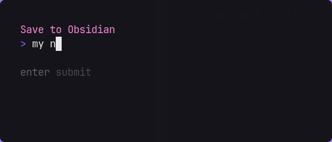
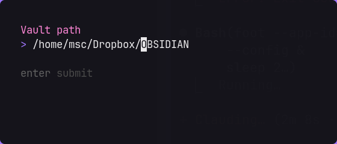

# obsidian-capture

A minimal keyboard-driven capture tool for [Obsidian](https://obsidian.md). Press a keybinding, type text or paste a URL, optionally add tags — it lands as a checkbox at the top of a note, with a timestamp.




```
- [ ] 2026-09-03 14:22 https://example.com #sr #readlater
```

## Features

- Floating TUI window, triggered by a keybinding
- Saves entries as Obsidian checkboxes with date and time
- Optional tags (`sr, annan` → `#sr #annan`)
- Edit vault path and note name from within the app
- New entries always prepended to the top of the note
- Note and folder created automatically if they don't exist

## Platforms

| Platform | Folder | Requirements |
|---|---|---|
| Linux (Omarchy/Hyprland) | `omarchy/` | foot, gum, Hyprland |
| macOS | `mac/` | gum (via Homebrew) |

---

## Linux — Omarchy / Hyprland

### Requirements

- [Hyprland](https://hyprland.org/) with [Omarchy](https://omarchy.org/)
- [foot](https://codeberg.org/dnkl/foot) terminal emulator
- [gum](https://github.com/charmbracelet/gum) (`pacman -S gum`)

### Install

```bash
git clone https://github.com/mattische/obsidian-capture
cd obsidian-capture/omarchy
bash install.sh
```

The installer will:
1. Copy the script to `~/.local/bin/`
2. Ask for your vault path and note name
3. Add keybindings to `~/.config/hypr/bindings.lua`
4. Add window rules to `~/.config/hypr/hyprland.lua`
5. Reload Hyprland

### Keybindings

| Keybinding | Action |
|---|---|
| `Super + I` | Open capture window |
| `Super + Shift + I` | Edit config (vault path, note name) |

### Config

`~/.config/obsidian-capture/config`:

```bash
# Path to your Obsidian vault
VAULT=~/Dropbox/MyVault

# Note where captures are saved (created automatically if it doesn't exist)
NOTE=Inbox.md
```

`NOTE` supports subdirectories: `NOTE=TODOs/Inbox.md`

---

## macOS

### Requirements

- [Homebrew](https://brew.sh)
- [gum](https://github.com/charmbracelet/gum) (installed automatically)

### Install

```bash
git clone https://github.com/mattische/obsidian-capture
cd obsidian-capture/mac
bash install.sh
```

Or via curl (no git required):

```bash
curl -fsSL https://raw.githubusercontent.com/mattische/obsidian-capture/master/mac/install.sh -o /tmp/install.sh && bash /tmp/install.sh
```

The installer will:
1. Install `gum` via Homebrew if needed
2. Copy the script to `/usr/local/bin/`
3. Ask for your vault path and note name
4. Create `Obsidian Capture.app` in `~/Applications`

### Setting up a keyboard shortcut

**Option A — macOS App Shortcuts (built-in):**
1. Open **System Settings → Keyboard → Keyboard Shortcuts → App Shortcuts**
2. Click **+**, set Application: `All Applications`
3. Menu Title: `Obsidian Capture`
4. Set your shortcut (e.g. `⌘⇧I`)

**Option B — Raycast:**
1. Open Raycast → Extensions → Script Commands
2. Add a new script pointing to `/usr/local/bin/obsidian-capture`
3. Assign a hotkey

### Config

`~/.config/obsidian-capture/config`:

```bash
# Path to your Obsidian vault
VAULT=~/Documents/MyVault

# Note where captures are saved (created automatically if it doesn't exist)
NOTE=Inbox.md
```

---

## Usage

1. Press your keybinding — a small floating terminal appears
2. Type text or paste a URL, press **Enter**
3. Optionally add tags (e.g. `sr, readlater`), press **Enter** (or just **Enter** to skip)
4. The entry is saved to the top of your note

To edit config from within the app, use **Super+Shift+I** (Linux) or re-run `install.sh` (Mac).

## Uninstall

```bash
rm ~/.local/bin/obsidian-capture        # Linux
rm /usr/local/bin/obsidian-capture      # macOS
rm -rf ~/.config/obsidian-capture
rm -rf ~/Applications/Obsidian\ Capture.app   # macOS only
```

For Linux, also remove the lines added to `~/.config/hypr/bindings.lua` and `~/.config/hypr/hyprland.lua`.
